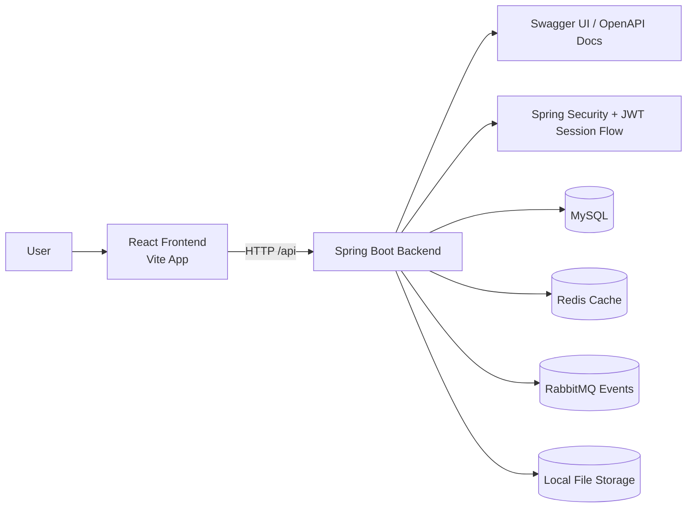
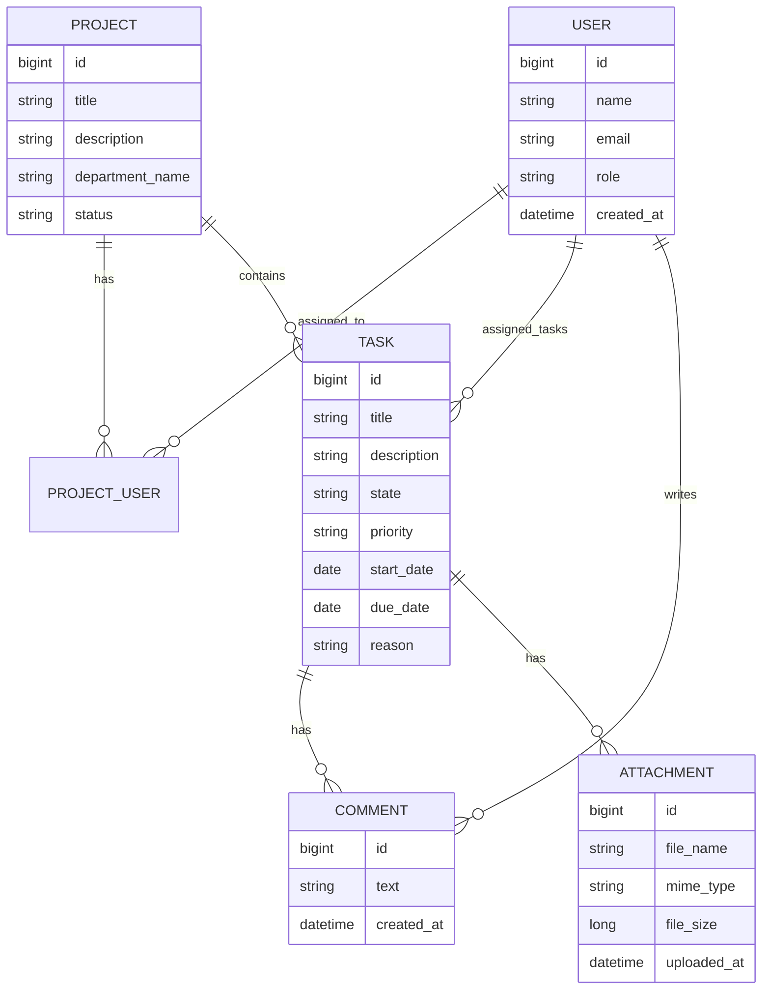

# Task Management Application

Task Management Application is a full-stack workspace app built with Spring Boot and React. It started from a classic CRUD foundation and has been shaped into a more product-minded system focused on delivery visibility, team coordination, and day-to-day task execution.

The goal is simple: keep projects, tasks, comments, files, and team accountability in one place without turning the experience into a heavy enterprise tool.

## What The Product Covers

- Authentication with role-based access
- Project and task management
- Kanban-style task flow
- Start date and due date planning
- Overview dashboard with delivery signals
- Comments and file attachments tied to tasks
- Swagger/OpenAPI documentation for technical review
- Optional RabbitMQ event publishing
- Optional Redis-backed caching
- Docker-based local setup

## Roles

- `ADMIN`
- `PROJECT_MANAGER`
- `TEAM_LEADER`
- `TEAM_MEMBER`

## Tech Stack

- Java 21
- Spring Boot 3.5.12
- Spring Security
- Spring Data JPA
- MySQL
- H2 for tests
- RabbitMQ
- Redis
- Springdoc OpenAPI
- React 18
- Vite 5

## Project Structure

```text
Task-Management-Application/
|-- backend/
|   |-- pom.xml
|   `-- src/
|-- frontend/
|   |-- package.json
|   `-- src/
`-- README.md
```

Backend package root: `io.github.barisaltinel.taskmanagement`

## Current Product Direction

This version leans more into planning and delivery visibility than the earlier bootcamp-style iterations.

Notable improvements:

- tasks support both `startDate` and `dueDate`
- overview screens surface overdue work, upcoming deadlines, and project health
- task creation is closer to a planning workflow than a minimal CRUD form
- the frontend is now backed by linting, automated tests, and a cleaner app structure
- optional messaging and caching integrations make the backend easier to grow
- Swagger/OpenAPI makes the API easier to inspect during reviews and integration work

## Demo Flow

If you want to walk a recruiter, teammate, or reviewer through the product, this sequence lands well:

1. Open the app and show the authenticated workspace entry.
2. Start on the overview page and highlight delivery pulse, overdue work, and upcoming deadlines.
3. Move into tasks and demonstrate creation, assignment, scheduling, and state progression.
4. Open projects and show how broader planning context sits above individual tasks.
5. Open Swagger UI and show that the backend is documented and testable without digging through controller code.
6. Finish with comments and file attachments to show collaboration around execution.

## API Documentation

The backend exposes public API documentation endpoints for technical review and integration work:

- Swagger UI: `http://localhost:8080/swagger-ui`
- OpenAPI JSON: `http://localhost:8080/v3/api-docs`

Swagger UI is public by default, while business endpoints still follow the project role model and bearer-token flow.

## Architecture Diagram



## ER Diagram



## Example API Requests

These examples match the current controllers and DTOs in the backend.

### Register

```http
POST /api/auth/register
Content-Type: application/json

{
  "name": "Baris Altinel",
  "email": "baris@example.com",
  "password": "StrongPassword123"
}
```

### Login

```http
POST /api/auth/login
Content-Type: application/json

{
  "email": "baris@example.com",
  "password": "StrongPassword123"
}
```

### Create Project

```http
POST /api/projects
Authorization: Bearer <token>
Content-Type: application/json

{
  "title": "Q3 Delivery Revamp",
  "description": "Improve delivery visibility and reduce blocked work.",
  "departmentName": "Product Engineering",
  "status": "ACTIVE",
  "teamMemberIds": [2, 3, 4]
}
```

### Create Task

```http
POST /api/tasks
Authorization: Bearer <token>
Content-Type: application/json

{
  "title": "Prepare executive dashboard",
  "description": "Build the first version of the delivery dashboard.",
  "priority": "HIGH",
  "state": "IN_PROGRESS",
  "startDate": "2026-07-09",
  "dueDate": "2026-07-16",
  "projectId": 1,
  "assigneeId": 2
}
```

### Cancel Task

```http
PUT /api/tasks/7/cancel?reason=Scope%20changed
Authorization: Bearer <token>
```

### Add Comment

```http
POST /api/comments
Authorization: Bearer <token>
Content-Type: application/json

{
  "taskId": 7,
  "text": "The API contract is ready for frontend integration."
}
```

### Upload Attachment

```http
POST /api/attachments
Authorization: Bearer <token>
Content-Type: multipart/form-data

file=<binary>
taskId=7
```

## Main API Areas

- `/api/auth`
- `/api/projects`
- `/api/tasks`
- `/api/attachments`
- `/api/users`
- `/api/comments`
- `/api/public/app-info`
- `/swagger-ui`
- `/v3/api-docs`

## Security Notes

- Production secrets are not stored in the repository.
- `backend/src/main/resources/application.properties` expects runtime secrets from environment variables.
- `backend/src/main/resources/application.example.properties` is the development-oriented template.
- `backend/src/main/resources/application-prod.example.properties` shows a safer production-style baseline.
- The optional bootstrap admin account is only created when `APP_BOOTSTRAP_ADMIN_EMAIL` and `APP_BOOTSTRAP_ADMIN_PASSWORD` are provided.
- H2 console access should stay disabled in production profiles.
- Swagger UI is public for documentation purposes, but protected endpoints still require the appropriate role and bearer token.

## Backend Setup

### Prerequisites

- Java 21
- Maven
- MySQL
- RabbitMQ only if you want event publishing enabled
- Redis only if you want shared caching enabled

### Configuration

Set these environment variables before starting the backend:

```powershell
$env:SPRING_DATASOURCE_URL="jdbc:mysql://localhost:3306/taskmanagement?useSSL=true&requireSSL=true&serverTimezone=UTC"
$env:SPRING_DATASOURCE_USERNAME="your_mysql_username"
$env:SPRING_DATASOURCE_PASSWORD="your_mysql_password"
```

Optional bootstrap admin values:

```powershell
$env:APP_BOOTSTRAP_ADMIN_NAME="Bootstrap Admin"
$env:APP_BOOTSTRAP_ADMIN_EMAIL="admin@example.com"
$env:APP_BOOTSTRAP_ADMIN_PASSWORD="change-this-password"
```

Springdoc defaults used by this project:

```properties
springdoc.api-docs.path=/v3/api-docs
springdoc.swagger-ui.path=/swagger-ui
```

### Optional RabbitMQ And Redis

Both integrations are opt-in. By default, the example config keeps them disabled:

```properties
app.rabbitmq.enabled=false
app.redis.enabled=false
```

Enable RabbitMQ if you want task-management events to be published through a broker:

```properties
app.rabbitmq.enabled=true
app.rabbitmq.exchange=taskmanagement.events
app.rabbitmq.queue=taskmanagement.activity
app.rabbitmq.routing-key=taskmanagement.activity
spring.rabbitmq.host=your-rabbitmq-host
spring.rabbitmq.port=5672
spring.rabbitmq.username=your-rabbitmq-user
spring.rabbitmq.password=your-rabbitmq-password
spring.rabbitmq.virtual-host=/
```

Enable Redis if you want a shared cache instead of the in-memory fallback:

```properties
app.redis.enabled=true
app.redis.cache-ttl=10m
spring.data.redis.host=your-redis-host
spring.data.redis.port=6379
spring.data.redis.password=your-redis-password
spring.data.redis.database=0
spring.data.redis.timeout=2s
```

### Run Backend

```powershell
cd backend
mvn spring-boot:run
```

Backend URL:

- `http://localhost:8080`

## Frontend Setup

```powershell
cd frontend
npm install
npm run dev
```

Frontend URL:

- `http://localhost:5173`

## Test, Lint, And Build

Backend tests:

```powershell
cd backend
mvn test
```

Frontend lint:

```powershell
cd frontend
npm run lint
```

Frontend tests:

```powershell
cd frontend
npm run test
```

Frontend production build:

```powershell
cd frontend
npm run build
```

Backend package build:

```powershell
cd backend
mvn -DskipTests package
```

The backend test profile keeps RabbitMQ and Redis disabled so the test suite stays independent from local broker and cache services. Production-style environments should keep the H2 console disabled and prefer `ddl-auto=validate` over `update`.

## Code Style

Backend formatting uses Spotless:

```powershell
cd backend
./mvnw spotless:apply
```

Frontend formatting uses Prettier:

```powershell
cd frontend
npm run format
```

## CI/CD

GitHub Actions is set up with a practical baseline for a portfolio project or a production-minded sample repository.

- `/.github/workflows/ci.yml` runs backend tests, frontend lint, frontend tests, frontend build, and `docker compose config`
- `/.github/workflows/docker-publish.yml` builds and publishes backend and frontend container images to GitHub Container Registry

The main CI workflow runs on:

- pushes to `main`
- pull requests targeting `main`
- manual dispatches

Example release flow:

```powershell
git tag v1.0.0
git push origin v1.0.0
```

Published image names:

- `ghcr.io/<your-github-username>/taskmanagement-backend`
- `ghcr.io/<your-github-username>/taskmanagement-frontend`

## Docker Setup

This Compose file is intentionally development-only. It uses demo credentials, enables optional infrastructure, and keeps `ddl-auto=update` for convenience.

```powershell
docker compose up --build
```

If a default host port is already in use, you can override it:

```powershell
$env:MYSQL_PORT="3307"
$env:BACKEND_PORT="18080"
$env:FRONTEND_PORT="13000"
docker compose up --build
```

Example with alternate ports for every service:

```powershell
$env:MYSQL_PORT="3307"
$env:RABBITMQ_PORT="5673"
$env:RABBITMQ_MANAGEMENT_PORT="15673"
$env:REDIS_PORT="6380"
$env:BACKEND_PORT="18080"
$env:FRONTEND_PORT="13000"
docker compose up --build
```

Default local endpoints:

- frontend UI: `http://localhost:3000`
- backend API: `http://localhost:8080`
- Swagger UI: `http://localhost:8080/swagger-ui`
- RabbitMQ management UI: `http://localhost:15672`

With the alternate port example above:

- frontend UI: `http://localhost:13000`
- backend API: `http://localhost:18080`
- Swagger UI: `http://localhost:18080/swagger-ui`
- RabbitMQ management UI: `http://localhost:15673`

Inside Docker:

- frontend is served with Nginx
- Nginx proxies `/api` requests to the backend container
- backend talks to MySQL, RabbitMQ, and Redis over the internal Docker network
- uploaded files are stored in the `backend_uploads` named volume

The Docker setup intentionally enables RabbitMQ and Redis so the full integration path can be exercised end to end.

Files involved in the container setup:

- `docker-compose.yml`
- `backend/Dockerfile`
- `frontend/Dockerfile`

## Positioning

This repository works well as:

- a portfolio-ready full-stack application
- a bootcamp project pushed toward a more production-minded standard
- a base for future additions such as task dependencies, audit trails, automations, and workflow rules
